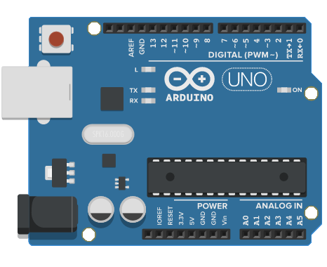
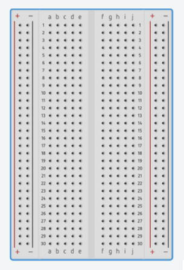
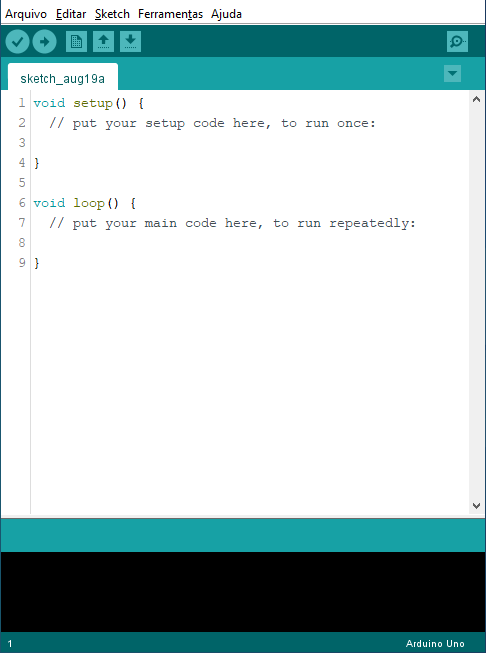
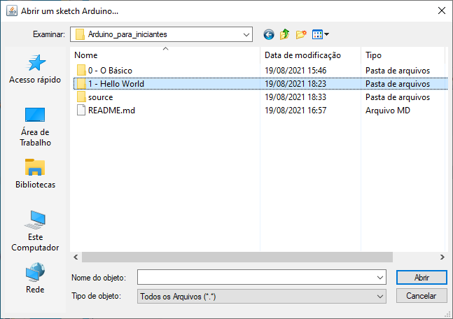
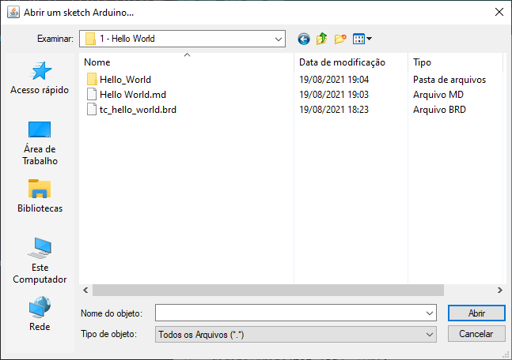
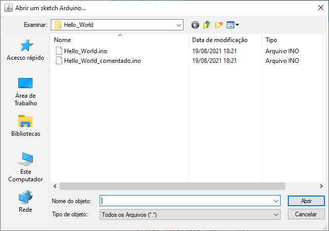

<b><h2> Criando seu primeiro programa para *Arduino* </h1></b> 

#

<b><h2> Material: </h2></b>

 Um Arduino, cabo USB do Arduino, protoboard, resistor 150ohns, led de qualquer cor.
Para fazer um programa p/ o Arduino e testa-lo precisaremos da Arduino IDE e do simulador de Arduino <b>TinkerCad</b>.   No caso de Arduinos paralelos precisa instalar um driver chamado CH340 

 

#

<b><h2> Downloads </h3></b>

<a href="https://www.arduino.cc/en/software"> Arduino IDE </a>

<a href="https://www.tinkercad.com"> TinkerCad </a></b>

<a href="https://www.google.com/amp/s/www.blogdarobotica.com/2020/03/21/instalando-driver-serial-para-arduinos-com-chip-ch340/amp/"> Driver CH340 </a>  

#
<b><h3> O que é um Arduino </h2></b>

Arduino é uma plataforma de prototipagem criada com o objetivo de facilitar o ensino de programação e eletrônica p/ jovens. Pela facilidade foi adotado pela comunidade do “faça você mesmo”.
(Foto do Arduino)
Ele possuí um conector P4 para alimentação, podendo receber até no máximo 9V e no mínimo 5V; Um conector USB tipo B por onde o Arduino é gravado; e os conectores de barra que são por onde acessamos as entradas e saída do Arduino.

   

#
<b><h3> O que é uma Protoboard </b></h3>

Protoboard ou placa de ensaio é uma placa com orifício utilizada para montar circuitos eletrônicos.
(Foto com o esquema de ligação)
As orifícios em linha estão conectados, as colunas não.

   

#
<b><h3> O que é um Resistor </b></h3>

O resistor é um dos componentes mais básicos da eletrônica e sua função é resistir a passagem de energia transformando eletricidade em energia térmica.
Os valores de resistência são determinados pelas listras coloridas em seu corpo, cada linha tem um valor e esse valor pode ser encontrado na tabela.
O que é um #Led
O led, sigla p/ light emmiting diode, ou diodo emissor de luz é um componente eletrônico que em resumo emite luz quando atravessado pela energia elétrica.

    

#
Após a instalação do Arduino IDE e do driver CH340 podemos iniciar o equivalente ao “hello world” do Arduino, o programa Blink.

#
## **Inicialize o Arduino IDE**
 
 
## **Vá em Arquivo -> Abrir**
 

## **Encontre o Código Hello World Comentado**
 
 
 
 
 
 

  <a href="https://www.tinkercad.com/things/aVVz9ZVGPe6"> Circuito no Tinkercad </a>
 