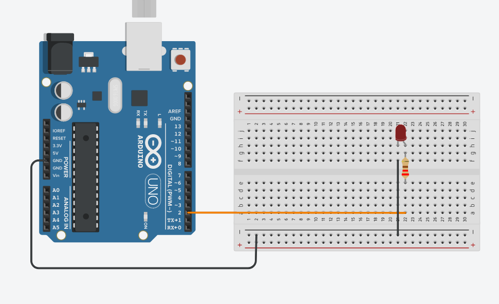

<h1 align="center"> <b>Entradas e saídas digitais</b></h1> 

<h2 align="center"> <b> Pinos digitais</b></h2>

Dos tres barramentos do Arduino Uno 22 pinos podem ser configurados para funcionar como entradas ou saídas analogicas (I/O - Input / Output).
Os pinos podem ser identificados na imagem a seguir.

 

Então antes de usa-los no programa esses pinos precisam ser configurados como entrada ou saida, para isso usamos a função <b>pinMode(Pino, Modo)</b>, onde o pino será o pino de desejamos, podendo ser usados valores referentes ao pino (ex: 2 , 11) ou o nome atribuido ao pino.
São 3 modos disponiveis para configurar os pinos, <b>INPUT, OUTPUT E INPUT_PULLUP</b>.
 

<b>INPUT:</b> Usado para setar o pino como entrada

<b>OUTPUT:</b> Usado para setar o pino como saída

<b>INPUT_PULLUP:</b> Usado para setar o pino como entrada com pullup interno.
 

<b>EX:  </b>

<b>     pinMode(2, INPUT)</b>

<b>     PinMode(led1, OUTPUT)</b>

<b>     PinMode(led1, INPUT_PULLUP)</b>  

Após a configurar o pinMode(), o Arduino ao inicializar saberá que aquele pino é uma entrada ou saída.

Para usar as I/O digitais usamos a função digitalWrite ou digitalRead. A <b>digitalWrite(pino, Valor)</b> usamos para saidas digitais e a <b>digitalRead(pino, Valor)</b> para entradas digitais.
 

<b>EX:  
</b>

<b>digitalWrite(2, HIGH)
</b>

<b>     digitalRead(led1, LOW)
</b> 

Onde HIGH é nivel lógico alto (5V) e LOW é nivel logico baixo (0V)
  

<h1 align="center"> <b>  Exemplo aplicado </b> </h1>

<b><h2> Material: </h2></b>

<nav>
    <ul>
        <li>Arduino UNO</li>
        <li>Cabo USB p/ Arduino</li>
        <li>Push button</li>
        <li>Led</li>
        <li>Resistor 220R e 10kR</li>
    </ul>
</nav>  

<b><h2> Links úteis: </h2></b> 

<a href="https://www.arduino.cc/en/software"> Arduino IDE </a>

<a href="https://www.tinkercad.com"> TinkerCad </a></b>  

<h2 align="center"><b> Iniciando... </b></h2> 

Primeiro começaremos demonstrando o funcionamento para utilizar uma saída digital do <b>Arduino<b>.
 

 
circuito saida digital 951x591
circuito entrada digital 970x538
circuito entrada pullup digital